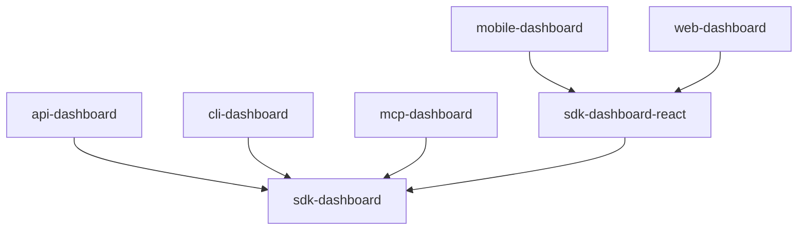
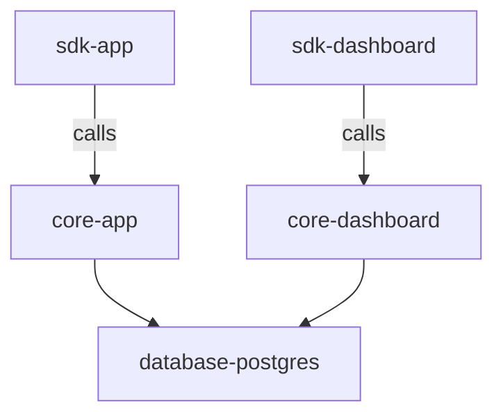
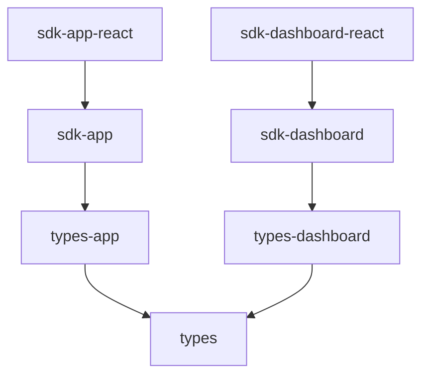

# Project Template

## Architecture

SDK connects clients to the core.

### Clients-to-SDK connections

```mermaid
graph TD
    api-app
    cli-app
    mcp-app
    mobile-app
    sdk-app
    sdk-app-react
    web-app

    api-app --> sdk-app
    cli-app --> sdk-app
    mcp-app --> sdk-app
    mobile-app --> sdk-app-react
    web-app --> sdk-app-react
    sdk-app-react --> sdk-app

```

```mermaid
graph TD
    api-dashboard
    cli-dashboard
    mcp-dashboard
    mobile-dashboard
    sdk-dashboard
    sdk-dashboard-react
    web-dashboard

    api-dashboard --> sdk-dashboard
    cli-dashboard --> sdk-dashboard
    mcp-dashboard --> sdk-dashboard
    mobile-dashboard --> sdk-dashboard-react
    web-dashboard --> sdk-dashboard-react
    sdk-dashboard-react --> sdk-dashboard

```

### SDKs-to-core connections

```mermaid
graph TD
    core-app
    core-dashboard
    database-postgres
    sdk-app
    sdk-dashboard

    core-app --> database-postgres
    core-dashboard --> database-postgres
    sdk-app -->|calls| core-app
    sdk-dashboard -->|calls| core-dashboard
```

### SDK type dependencies

```mermaid
graph TD
    sdk-app
    sdk-app-react
    sdk-dashboard
    sdk-dashboard-react

    sdk-app --> types-app
    sdk-dashboard --> types-dashboard
    sdk-app-react --> sdk-app
    sdk-dashboard-react --> sdk-dashboard
    types-app --> types
    types-dashboard --> types
```
